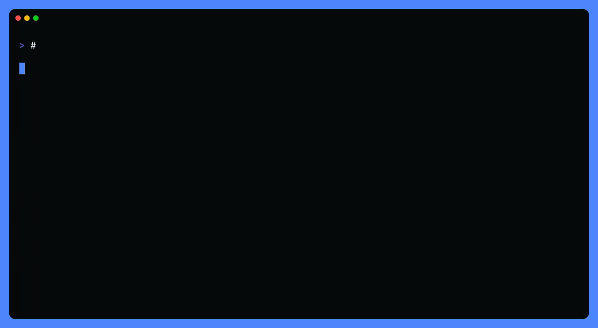

<p align="center">
  <a href="https://nika.sh">
    <picture>
      <source media="(prefers-color-scheme: dark)" srcset="https://nika.sh/brand/nika-logo-dark.svg">
      
    </picture>
  </a>
</p>

<h1 align="center">gh nika</h1>

<p align="center">
  <strong>The whole <code>nika</code> CLI behind the GitHub CLI: audit a workflow, run it, verify its trace.</strong><br>
  A pass-through extension: a <code>nika</code> on your PATH wins; otherwise it fetches the released engine once, checksum-verified.
</p>

<p align="center">
  <a href="https://github.com/supernovae-st/gh-nika/releases/latest"></a>
  <a href="https://github.com/supernovae-st/gh-nika/actions/workflows/ci.yml"></a>
  <a href="https://github.com/supernovae-st/nika/releases/latest"></a>
  <a href="https://docs.nika.sh"></a>
  <a href="LICENSE"></a>
</p>

<p align="center">
  <a href="https://scorecard.dev/viewer/?uri=github.com/supernovae-st/gh-nika"></a>
  <a href="https://archive.softwareheritage.org/browse/origin/?origin_url=https://github.com/supernovae-st/gh-nika"></a>
</p>

## Thirty seconds, no API key

The GitHub CLI you already have installs the extension. The first call brings
the engine:

```sh
gh extension install supernovae-st/gh-nika
gh nika --version
```

```
gh-nika: fetching nika v0.118.7 (macos-arm64, checksum-verified)…
nika-macos-arm64-0.118.7.tar.gz: OK
nika 0.118.7 (f3a31a6ee)
```

The two fetch lines print once, on a machine with no `nika` on its PATH: the
engine's own release asset for your platform, checked against the release
`SHA256SUMS` before it is extracted. Every later call answers with the version
alone. A `nika` already on your PATH answers from the first call, and nothing
is downloaded.

Every engine command reads the same behind `gh`; the arguments pass through
untouched:

```sh
gh nika --help
```

```
nika             a plan from a file
nika try         rehearsal · to own the file: nika new <slug>
nika new hello   one file that runs on this machine
nika run         run a file
nika check       audit · in the file, permits = what this file is allowed to touch
nika doctor      PATH, model, sandbox · isolate with env -i HOME=$scratch PATH="$PATH" nika …
```

Write `hello.nika.yaml`. The `mock/echo` model rehearses with no key and no
network:

```yaml
nika: hello
model: mock/echo
permits: {}
tasks:
  greeting:
    infer:
      prompt: "Say hello from the gh door."
      max_tokens: 32
outputs:
  greeting: ${{ tasks.greeting.output }}
```

Audit it before anything runs:

```sh
gh nika check hello.nika.yaml
```

```
 ✔ ORDER    no exec: sits downstream of a net-effecting task · unauthored content never reaches a shell
 ✔ PERMITS  literal + const: args fit the boundary · computed paths + symlinks are the RUN's verdict
 ✔ TRIFECTA no lethal trifecta over the declared permits: without a human gate
 ✔ JOURNEY internal · 0 sources · 0 destinations · 1 model endpoint · no secret reaches an external destination
 ✔ audited · 1 task · 1 wave · permits {} · est out ≤$0.0000 · 0 hints · risk low
 layers · valid ✔ · access ready ✔ · capacity fit ✔ · run ready ✔
```

These are the closing lines of the card. Above them the same card reports the
plan and its waves, the model access, the cost ceiling, the secrets, the
types, the tools, the schema, the gates and the writes.

Run it under a cost ceiling of zero:

```sh
gh nika run hello.nika.yaml --max-cost-usd 0
```

```
  🦋 nika · hello · 1 task
     permits ✓ declared boundary · default-deny

  ✔  greeting  infer · mock/echo  1ms
  ── 1/1 done · unpriced (1 call) · elapsed 0.0s ─────────────────
    wrote .nika/traces
    said "mock(echo) · Say hello from the gh door."
    trace: .nika/traces/2026-09-10T14-37-50Z-f7f0.ndjson · 6 events · chain 34060a5d2c1200510a9dcc5dd7491c97b44fb1c426eb1cd54ff68464ca5c4c9a · sealed
```

Around this excerpt the engine prints two rehearsal advisories: a mock model
echoes the prompt, it is not a real answer. `--output json` writes the typed
`outputs:` as one JSON object on stdout:
`{"greeting":"mock(echo) · Say hello from the gh door."}`.

Then verify the trace it sealed:

```sh
gh nika trace verify .nika/traces/2026-09-10T14-37-50Z-f7f0.ndjson
```

The engine climbs its proof ladder and exits 0: `OK` (6 events, chain intact,
the head equal to the one the run printed), `SEALED` (the `run_sealed`
signature verifies against your run-signing key), `ANCHORED` reported as no
sidecar, `REPLAYED` reported as not asked, and `COST-REPLAY` re-judging the
budget from the journaled dollars. The highest tier honestly attained is
`sealed`; `--json` returns the same verdict as one document.



*Recorded by `scripts/media/gh-check.tape` on 2026-07-31 against the engine
release of that day; every line on screen is the engine's own output. The
card has grown since (the `ACCESS`, `EXEC`, `RETRY`, `ORDER` and `JOURNEY`
lines): the text above is 0.118.7's.*

## Why this door

- **Zero separate install.** Where `gh` is already the tooling spine (Actions
  runners, Codespaces, locked-down laptops), `gh extension install` is the
  only step. The engine arrives on the first call, from the engine's own
  GitHub release, through the `gh` you are already signed in with.
- **Audited before it runs.** `gh nika check` is the engine's verdict on the
  order of effects, the permits, the lethal trifecta, the journey of every
  secret and the cost floor. A red check never becomes a run.
- **Sovereign by default.** The same file runs on local models (Ollama,
  llama.cpp, vLLM), on Mistral, Hugging Face, OpenAI, xAI, Anthropic and the
  rest of the engine's catalog; `mock/echo` rehearses with no key and no
  network. Nothing leaves your machine through this extension except the
  release lookups that fetch the engine.
- **Traced after.** Every run leaves a hash-chained journal under
  `.nika/traces/`, and `gh nika trace verify` climbs its proof ladder. The
  extension routes argv and gets out of the way: the engine answers, this
  script adds nothing to the proof and takes nothing away.

## How it finds the engine

Read from the script, in order:

1. **A `nika` on your PATH wins.** The extension is `exec nika "$@"`: argv
   intact, nothing downloaded. An engine you installed another way (Homebrew
   `supernovae-st/tap/nika`, npm `@supernovae-st/nika`, the install script)
   answers at the version you pinned.
2. **Otherwise the cached engine.** `${XDG_DATA_HOME:-~/.local/share}/gh-nika/nika`,
   or `$GH_NIKA_DIR/nika` when that variable is set.
3. **Otherwise the latest release, once.** `gh release view` names the
   engine's latest tag, `gh release download` fetches
   `nika-<macos|linux>-<x64|arm64>-<version>.tar.gz` together with
   `SHA256SUMS`; the asset must be listed in that file and its digest must
   match (`sha256sum -c`, or `shasum -a 256 -c` where only that exists) before
   the tarball is extracted into the cache. The tarball carries the binary
   and its shell completions (`completions/nika.bash`, `_nika`, `nika.fish`).

Variables · `GH_NIKA_DIR` moves the cache · `GH_NIKA_REFRESH=1` discards the
cached binary and fetches the latest release again, verified the same way ·
`GH_TOKEN` is what `gh` itself needs on a runner.

```sh
GH_NIKA_REFRESH=1 gh nika --version
```

```
gh-nika: fetching nika v0.118.7 (macos-arm64, checksum-verified)…
nika-macos-arm64-0.118.7.tar.gz: OK
nika 0.118.7 (f3a31a6ee)
```

The download lane tracks the engine's latest release; the extension holds no
engine pin of its own. To pin the engine, put a pinned `nika` on the PATH and
lane 1 takes it. Supported platforms: macOS and Linux, x64 and arm64; anything
else is refused with a message before any download.

## In CI

Wherever the GitHub CLI is preinstalled (GitHub-hosted runners are), the
extension needs only the job token:

```yaml
- run: |
    gh extension install supernovae-st/gh-nika
    gh nika check flows/report.nika.yaml
  env:
    GH_TOKEN: ${{ github.token }}
```

This repository's own CI exercises the download lane this way on every push
and pull request (see Proof). For a PR comment carrying the check verdict and
the DAG, [nika-action](https://github.com/supernovae-st/nika-action) is the
purpose-built lane.

## Security

What this script does, and does not do, read from its source (`gh-nika`, one
bash file under `set -euo pipefail`):

- **Its only network calls are `gh release view` and `gh release download`**
  against `supernovae-st/nika`, through your authenticated `gh`: one lookup of
  the latest tag, one download of the asset, one of `SHA256SUMS`. No
  telemetry, no other host, no elevated privileges, nothing written outside
  the cache directory and a temporary directory removed on exit.
- **Nothing runs before its checksum passes.** The asset must be listed in the
  release `SHA256SUMS` and its digest must match, or the install refuses with
  exit 1 and leaves nothing behind. The extension does not verify build
  provenance or a signature: the checksum file comes from the same release as
  the asset. The engine's releases also publish a provenance attestation
  (`multiple.intoto.jsonl`) for readers who verify the build outside this
  script.
- **The cache is a user-writable directory.** Anyone who can write to it can
  replace the binary; `GH_NIKA_REFRESH=1` fetches and verifies again at any
  time, and a `nika` on the PATH bypasses the cache entirely.
- **The workflow's boundary is the engine's.** `permits:`, the sandbox, the
  cost ceiling and the trace are the engine's, passed through untouched; this
  extension grants nothing and cannot widen them.

Report a vulnerability to **security@supernovae.studio**, never through a
public issue: the organization's
[security policy](https://github.com/supernovae-st/.github/blob/main/SECURITY.md)
applies to this repository and treats supply-chain reports, install scripts
included, as highest severity.

## Proof

Every push to `main` and every pull request runs
[`ci.yml`](.github/workflows/ci.yml):

| gate | what it proves |
|---|---|
| `shellcheck gh-nika` | the script is lint-clean |
| `shfmt -d -i 2 -ci -bn gh-nika` | the formatting is canonical; a diff fails the job |
| smoke · pass-through | a fake `nika` placed first on the PATH receives `check flow.nika.yaml --json`, argv intact |
| smoke · download | with no `nika` on the PATH and a scratch `GH_NIKA_DIR`, `./gh-nika --version` fetches the real latest release, verifies it and leaves an executable in the cache |
| smoke · refresh | `GH_NIKA_REFRESH=1 ./gh-nika --version` fetches and verifies it again |

Every action is pinned to a commit SHA and Dependabot moves the pins in one
grouped weekly PR. [`scorecard.yml`](.github/workflows/scorecard.yml)
publishes the OpenSSF Scorecard result weekly and on every push to `main`;
the badge above reads it.

Replay the first three gates locally:

```sh
shellcheck gh-nika
shfmt -d -i 2 -ci -bn gh-nika
mkdir -p /tmp/fakebin && printf '#!/usr/bin/env bash\necho "FAKE argv: $*"\n' > /tmp/fakebin/nika && chmod +x /tmp/fakebin/nika
PATH="/tmp/fakebin:$PATH" ./gh-nika check flow.nika.yaml --json
```

```
FAKE argv: check flow.nika.yaml --json
```

## Upgrade

```sh
gh extension upgrade nika
```

That upgrades the wrapper. The cached engine stays where it is:
`GH_NIKA_REFRESH=1 gh nika --version` discards it and fetches the latest
release, checksum-verified like the first time. `gh nika doctor` reports what
the engine sees on this machine: the binary, the providers, the seats and the
editors it is wired to.

## Uninstall

```sh
gh extension remove nika
rm -rf "${XDG_DATA_HOME:-$HOME/.local/share}/gh-nika"
```

## Documentation

- `gh nika --help` · the engine's card. `gh nika try` lists its rehearsal
  examples and `gh nika try 01-hello` runs one offline; `gh nika new
  <template> <file>` is the creation door; `gh nika explain NIKA-AUTH-006`
  teaches a finding and links its page.
- [docs.nika.sh](https://docs.nika.sh) · the language, the engine and the
  other doors.
- [supernovae-st/nika](https://github.com/supernovae-st/nika) · the engine,
  its releases and their `SHA256SUMS`.
- [nika-spec](https://github.com/supernovae-st/nika-spec) · the law of the
  language.
- [nika-action](https://github.com/supernovae-st/nika-action) · check
  verdicts as pull-request comments.

<!-- city:map -->
## The city · where this repo sits

```text
📜 nika-spec ──── language law and conformance
    │
    ▼
⚙️ nika ───────── engine, admission, execution, receipts and schedules
    │
    ▼
⚡ gh-nika ────── this door, installed as gh extension install supernovae-st/gh-nika: the engine behind gh
    │
    ▼
🧩 any terminal or CI runner that already has the GitHub CLI
```

This repository consumes engine behavior and serves GitHub CLI users. It is
not authoritative for the workflow language.

All the buildings: [nika-spec](https://github.com/supernovae-st/nika-spec) ·
[nika](https://github.com/supernovae-st/nika) ·
[nika.sh](https://github.com/supernovae-st/nika.sh) ·
[nika-docs](https://github.com/supernovae-st/nika-docs) ·
[nika-client](https://github.com/supernovae-st/nika-client) ·
[nika-vscode](https://github.com/supernovae-st/nika-vscode) ·
[nika-plugins](https://github.com/supernovae-st/nika-plugins) ·
[gh-nika](https://github.com/supernovae-st/gh-nika) ·
[homebrew-tap](https://github.com/supernovae-st/homebrew-tap) ·
[nika-action](https://github.com/supernovae-st/nika-action) ·
[nika-actions-starter](https://github.com/supernovae-st/nika-actions-starter) ·
[nika-registry](https://github.com/supernovae-st/nika-registry) ·
[nika-estate](https://github.com/supernovae-st/nika-estate).
<!-- /city:map -->

## License

[Apache-2.0](LICENSE) for this wrapper. The engine it fetches is
[AGPL-3.0-or-later](https://github.com/supernovae-st/nika/blob/main/LICENSE);
the language spec is [Apache-2.0](https://github.com/supernovae-st/nika-spec).
Installing this extension does not impose the engine's copyleft license on
your workflows.

Security · [the organization's policy](https://github.com/supernovae-st/.github/blob/main/SECURITY.md) ·
security@supernovae.studio. Contributing · open an issue or a pull request on
this repository; CI runs the gates above on every PR, under the
[code of conduct](https://github.com/supernovae-st/.github/blob/main/CODE_OF_CONDUCT.md).
Docs · [docs.nika.sh](https://docs.nika.sh) · [nika.sh](https://nika.sh).
