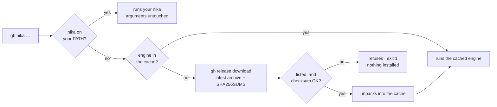

<p align="center">
  <a href="https://nika.sh">
    <picture>
      <source media="(prefers-color-scheme: dark)" srcset="https://nika.sh/brand/nika-logo-dark.svg">
      
    </picture>
  </a>
</p>

<h1 align="center">gh nika</h1>

<p align="center">
  <strong>Use Nika from the GitHub CLI you already have: one install, then check, run and verify AI workflows.</strong><br>
  Every <code>nika</code> command works behind <code>gh nika</code>. The engine arrives on first use, checksum-verified, and a <code>nika</code> already on your PATH always wins.
</p>

<p align="center">
  <a href="https://github.com/supernovae-st/gh-nika/releases/latest"></a>
  <a href="https://github.com/supernovae-st/gh-nika/actions/workflows/ci.yml"></a>
  <a href="https://github.com/supernovae-st/nika/releases/latest"></a>
  <a href="https://docs.nika.sh"></a>
  <a href="LICENSE"></a>
  <br>
  <a href="https://scorecard.dev/viewer/?uri=github.com/supernovae-st/gh-nika"></a>
  <a href="https://archive.softwareheritage.org/browse/origin/?origin_url=https://github.com/supernovae-st/gh-nika"></a>
</p>

<!-- engine clips: served from the engine repository's main branch (media/), so they follow its latest render, not a release tag -->
<p align="center"><b>Watch four commands take a first workflow from nothing to a verified run, offline and with no key.</b></p>
<p align="center">
  <a href="https://raw.githubusercontent.com/supernovae-st/nika/main/media/gifs/full-loop.optimized.gif">
    
  </a>
</p>
<p align="center"><sub>The four <code>nika</code> commands this extension passes through. Behind the GitHub CLI you type them after <code>gh</code>, as in <code>gh nika check hello.nika</code>. Notice that <code>trace verify</code> reads back the chain head the run printed. Captured from the real CLI; the run is a <code>mock/echo</code> rehearsal. Click to open it full size.</sub></p>

## What is Nika?

Nika turns repeatable AI work into a small file you keep. Say what you
want done, like *"every Monday, pull the action items out of my meeting
notes"*, and Nika writes it as a readable `.nika` workflow. Before
anything runs, `nika check` shows what the workflow will do, which models
and tools it uses, what it is allowed to touch and what it can cost,
without calling a model. You run it when you decide, with the model you
choose, local or cloud, and every run leaves a tamper-evident record you
can verify. One Rust binary, local-first, open source (AGPL-3.0).

| 1 · Say it | 2 · Check it | 3 · Run it | 4 · Prove it |
|:---:|:---:|:---:|:---:|
| Describe the job; Nika writes a `.nika` file | `nika check` audits it before any model is called | `nika run` with the model you choose | `nika trace verify` checks the run's record |

> [!TIP]
> **This extension gives you all four steps behind `gh`.** It is one short
> bash script that hands your arguments to the Nika engine and adds nothing
> to what the engine says. Use it wherever the GitHub CLI is already your
> toolbox: GitHub Actions runners, Codespaces, a locked-down laptop.

<p align="center">
  <a href="#quick-start">Quick start</a> ·
  <a href="#what-you-get">What you get</a> ·
  <a href="#every-command-behind-gh">Commands</a> ·
  <a href="#how-it-finds-the-engine">How it finds the engine</a> ·
  <a href="#use-it-in-ci">CI</a> ·
  <a href="#security">Security</a> ·
  <a href="#upgrade-and-uninstall">Upgrade</a>
</p>

## Quick start

Three steps, no API key.

**1 · Install the extension.**

```sh
gh extension install supernovae-st/gh-nika
```

**2 · Write a first workflow.** `compile hello` writes a one-task workflow
that rehearses on `mock/echo`, a stand-in model that echoes its prompt: no
key, no network.

```sh
gh nika compile hello hello.nika
```

On a machine without `nika`, this first call also downloads the engine once
and checks it against the release checksums, for example on Linux x64:

```text
gh-nika: fetching nika v0.121.0 (linux-x64, checksum-verified)…
nika-linux-x64-0.121.0.tar.gz: OK
```

**3 · Check it, run it, verify the run.**

```sh
gh nika check hello.nika
gh nika run hello.nika
gh nika trace verify
```

| Command | What you see |
|---|---|
| `gh nika check hello.nika` | the audit card, ending in `run ready ✔`; nothing has run yet |
| `gh nika run hello.nika` | the task done on `mock/echo`, what it said, and the trace file with its chain head |
| `gh nika trace verify` | `OK — … · chain intact`, with the same head the run printed |

> [!TIP]
> Run `gh nika key init` once to mint a run-signing key: every later run on
> this machine is sealed, and `gh nika trace verify` then reports `SEALED` too.

<!-- motion: gh extension install, the first gh nika call fetching and checksum-verifying the engine, then gh nika check and gh nika run -->

## What you get

<table>
  <tr>
    <td width="33%" valign="top"><b>One install</b><br><code>gh extension install supernovae-st/gh-nika</code> is the whole setup. The engine comes with the first call.</td>
    <td width="33%" valign="top"><b>The whole CLI</b><br>Every <code>nika</code> command and flag works after <code>gh nika</code>. Your arguments reach the engine untouched.</td>
    <td width="33%" valign="top"><b>Checked before it runs</b><br><code>gh nika check</code> shows what a workflow can touch and what it can cost, before any model is called.</td>
  </tr>
  <tr>
    <td valign="top"><b>A run you can verify</b><br>Every run leaves a hash-chained trace in <code>.nika/traces/</code>, and <code>gh nika trace verify</code> checks it.</td>
    <td valign="top"><b>Your model, your call</b><br>Local models (Ollama, llama.cpp, vLLM) or cloud providers (OpenAI, Anthropic, Mistral, xAI, Hugging Face and more). <code>mock/echo</code> rehearses with no key.</td>
    <td valign="top"><b>A verified download</b><br>The engine must match its release's <code>SHA256SUMS</code> before it is unpacked, and your own <code>nika</code> always takes precedence.</td>
  </tr>
</table>

The clips below show the `nika` commands; behind the GitHub CLI you type
them after `gh`.

**Audit first, then run: watch a workflow checked, then run on a local
model.**

<p align="center">
  <a href="https://raw.githubusercontent.com/supernovae-st/nika/main/media/gifs/nika-hero.optimized.gif">
    
  </a>
</p>
<p align="center"><sub><code>check</code>, then a real local-model <code>run</code> and the action items it wrote. Notice the owners, tasks and due dates landing in a typed file. The check is captured from the real CLI and the run is a captured local-model run (<code>ollama/llama3.2:3b</code>). Click to open it full size.</sub></p>

**Caught before it runs: watch `check` find two mistakes, then pass the
fixed file.**

<p align="center">
  <a href="https://raw.githubusercontent.com/supernovae-st/nika/main/media/gifs/static-check-fix.optimized.gif">
    
  </a>
</p>
<p align="center"><sub><code>check</code> finds two defects, then passes the fixed file. Notice that each finding names its code and its fix. Output captured from the real CLI; nothing runs and no token is spent. Click to open it full size.</sub></p>

**Start from a job: watch `try` list the ready-made workflows built into
the engine.**

<p align="center">
  <a href="https://raw.githubusercontent.com/supernovae-st/nika/main/media/gifs/workflow-gallery.optimized.gif">
    
  </a>
</p>
<p align="center"><sub><code>try</code> lists the ready-made workflows built into the engine. Notice the marks on each card: the verbs its tasks use. The names, verbs and lines are the real <code>nika try</code> listing. Click to open it full size.</sub></p>

## Every command, behind gh

| You type | What it does |
|---|---|
| `gh nika try` | lists the ready-made workflows; `gh nika try 01-hello` rehearses one offline |
| `gh nika compile hello hello.nika` | writes a first workflow; `gh nika compile --list` names the other skeletons |
| `gh nika check <file>` | the audit, before any model is called |
| `gh nika run <file>` | the run, with the model you pick (`--model`), a cost ceiling (`--max-cost-usd`) or the typed outputs as JSON (`--output json`) |
| `gh nika trace verify` | checks the record of the latest run |
| `gh nika explain NIKA-AUTH-006` | teaches one finding and links its page |
| `gh nika doctor` | what the engine finds on this machine: sandbox, local models and providers, access paths, each with a fix when something is missing |
| `gh nika --help` | the engine's own command card (`--help --all` for every flag) |

Arguments pass through untouched, so the [CLI reference](https://docs.nika.sh/reference/cli)
applies word for word: prefix each command with `gh`.

## How it finds the engine


```mermaid
flowchart LR
    call["gh nika …"] --> onpath{"nika on<br/>your PATH?"}
    onpath -- "yes" --> yours["runs your nika<br/>arguments untouched"]
    onpath -- "no" --> cached{"engine in<br/>the cache?"}
    cached -- "yes" --> engine["runs the cached engine"]
    cached -- "no" --> fetch["gh release download<br/>latest archive + SHA256SUMS"]
    fetch --> sums{"listed, and<br/>checksum OK?"}
    sums -- "no" --> refuse["refuses · exit 1<br/>nothing installed"]
    sums -- "yes" --> unpack["unpacks into the cache"]
    unpack --> engine
```

1. **Your `nika` wins.** When `nika` is on your PATH, the extension runs
   `exec nika "$@"`: arguments intact, nothing downloaded. An engine you
   installed another way (Homebrew `supernovae-st/tap/nika`, npm
   `@supernovae-st/nika`, the install script) answers at the version you
   chose.
2. **Otherwise, the cached engine** in
   `${XDG_DATA_HOME:-~/.local/share}/gh-nika/nika`, or `$GH_NIKA_DIR/nika`
   when that variable is set. It never updates itself.
3. **Otherwise, the latest release, once.** `gh release view` names the
   engine's latest tag, and `gh release download` fetches
   `nika-<macos|linux>-<x64|arm64>-<version>.tar.gz` with the release's
   `SHA256SUMS`. The archive must be listed in that file and match its
   checksum (`sha256sum -c`, or `shasum -a 256 -c` where only that exists)
   before it is unpacked into the cache, with its shell completions
   (`completions/nika.bash`, `_nika`, `nika.fish`).

The cache and these variables only come into play when no `nika` is on your
PATH:

| Variable | What it does |
|---|---|
| `GH_NIKA_DIR` | moves the cache (default `${XDG_DATA_HOME:-~/.local/share}/gh-nika`) |
| `GH_NIKA_REFRESH=1` | deletes the cached engine and fetches the latest release again, verified the same way |
| `GH_TOKEN` | what `gh` itself needs to download on a runner |

```sh
GH_NIKA_REFRESH=1 gh nika --version
```

> [!NOTE]
> The download follows the engine's latest release: the extension holds no
> engine pin of its own. To pin a version, put that `nika` on your PATH and
> step 1 takes it. macOS and Linux on x64 or arm64 are supported; any other
> system is refused with a message before anything is downloaded.

## Use it in CI

GitHub-hosted runners come with the GitHub CLI, so the job token is all the
extension needs:

```yaml
- run: |
    gh extension install supernovae-st/gh-nika
    gh nika check flows/report.nika
  env:
    GH_TOKEN: ${{ github.token }}
```

This repository's own CI exercises the download path with the job token on
every push and pull request ([how it is tested](#how-this-repository-is-tested)).

> [!TIP]
> Want the verdict as a comment on each pull request, with the workflow's
> graph? [nika-action](https://github.com/supernovae-st/nika-action) is built
> for exactly that.

## Security

What the script does and does not do, read from its source: [`gh-nika`](gh-nika),
one bash file under `set -euo pipefail`.

- **It talks only to GitHub, through your `gh`.** Its only network calls are
  `gh release view` and `gh release download` against `supernovae-st/nika`:
  one lookup of the latest tag, one download of the archive, one of
  `SHA256SUMS`. No telemetry, no other host, no elevated privileges.
- **Nothing runs before its checksum passes.** The archive must be listed in
  the release's `SHA256SUMS` and match it, or the script stops with exit 1
  and installs nothing.
- **A checksum is not a signature.** `SHA256SUMS` comes from the same release
  as the archive: it proves the download is intact, not who built it. The
  engine's releases also publish a provenance attestation
  (`multiple.intoto.jsonl`) for readers who verify the build themselves.
- **It writes in two places only**: the cache directory, and a temporary
  download directory from `mktemp -d`. That temporary directory is removed
  when the install stops on an error; after a successful install the script
  hands over to the engine with `exec`, so the downloaded archive stays there
  until your system clears its temp folder.
- **The cache is yours to protect.** Anyone who can write to it can replace
  the binary. `GH_NIKA_REFRESH=1` fetches and verifies again at any time, and
  a `nika` on your PATH bypasses the cache entirely.
- **The workflow's boundary is the engine's.** `permits:` (what a workflow
  may read, write, reach and run), the sandbox, the cost ceiling and the trace
  are the engine's, passed through untouched: this extension grants nothing
  and cannot widen them.

> [!IMPORTANT]
> Report a vulnerability to **security@supernovae.studio**, never in a public
> issue. The organization's
> [security policy](https://github.com/supernovae-st/.github/blob/main/SECURITY.md)
> applies to this repository and treats supply-chain reports, install scripts
> included, as highest severity.

## Upgrade and uninstall

```sh
gh extension upgrade nika                  # upgrades the extension script
GH_NIKA_REFRESH=1 gh nika --version        # re-fetches the latest engine, checksum-verified
```

Upgrading the extension leaves the cached engine where it is; the refresh
above replaces it. `gh nika doctor` then reports what the engine finds on
this machine.

```sh
gh extension remove nika
rm -rf "${XDG_DATA_HOME:-$HOME/.local/share}/gh-nika"   # or your GH_NIKA_DIR
```

## How this repository is tested

Every push to `main` and every pull request runs
[`ci.yml`](.github/workflows/ci.yml):

| Gate | What it proves |
|---|---|
| `shellcheck gh-nika` | the script is lint-clean |
| Retired-suffix ratchet | `scripts/suffix_ratchet.py`, its self-test and unit tests: no retired workflow-file suffix outside the pinned exceptions |
| `shfmt -d -i 2 -ci -bn gh-nika` | the formatting is canonical; any diff fails the job |
| Smoke · pass-through | a fake `nika` first on the PATH receives `check flow.nika --json`, arguments intact |
| Smoke · download | with no `nika` on the PATH and a scratch `GH_NIKA_DIR`, `./gh-nika --version` fetches the real latest release, verifies it and leaves an executable in the cache |
| Smoke · refresh | `GH_NIKA_REFRESH=1 ./gh-nika --version` fetches and verifies it again |

Every action is pinned to a commit SHA, and Dependabot moves the pins in one
grouped weekly pull request. [`scorecard.yml`](.github/workflows/scorecard.yml)
publishes the OpenSSF Scorecard weekly and on every push to `main`; the badge
above reads it.

<details>
<summary><b>Replay the offline gates on your machine</b></summary>

```sh
shellcheck gh-nika
shfmt -d -i 2 -ci -bn gh-nika
python3 scripts/suffix_ratchet.py && python3 scripts/suffix_ratchet.py --selftest
python3 -m unittest scripts/test_suffix_ratchet.py
fakebin="$(mktemp -d)"
printf '#!/usr/bin/env bash\necho "FAKE argv: $*"\n' > "$fakebin/nika" && chmod +x "$fakebin/nika"
PATH="$fakebin:$PATH" ./gh-nika check flow.nika --json
```

The last command prints `FAKE argv: check flow.nika --json`: the extension
handed the arguments over unchanged.

</details>

## Documentation

- `gh nika --help`: the engine's own command card. `gh nika explain <CODE>`
  teaches any finding.
- [docs.nika.sh](https://docs.nika.sh): the language, the engine and
  [every way to install and connect it](https://docs.nika.sh/integrations/everywhere).
- [supernovae-st/nika](https://github.com/supernovae-st/nika): the engine,
  its releases and their `SHA256SUMS`.
- [nika-spec](https://github.com/supernovae-st/nika-spec): the language
  specification.
- [nika-action](https://github.com/supernovae-st/nika-action): check verdicts
  as pull-request comments.

<!-- city:map -->
## 🦋 The Nika family

| | Repository | What it gives you |
|---|---|---|
| 🦋 | [nika](https://github.com/supernovae-st/nika) | The engine and CLI: write, check, run and verify AI workflows |
| 📖 | [nika-docs](https://github.com/supernovae-st/nika-docs) | The documentation, live at [docs.nika.sh](https://docs.nika.sh) |
| 📜 | [nika-spec](https://github.com/supernovae-st/nika-spec) | The language specification and the suite that proves an engine follows it |
| 🧩 | [nika-vscode](https://github.com/supernovae-st/nika-vscode) | The editor extension: your workflow as a live graph, errors as you type |
| 🟦 | [nika-client](https://github.com/supernovae-st/nika-client) | Run and verify workflows from TypeScript |
| ✅ | [nika-action](https://github.com/supernovae-st/nika-action) | A GitHub Action that posts a `nika check` verdict on your pull requests |
| 🚀 | [nika-actions-starter](https://github.com/supernovae-st/nika-actions-starter) | A ready template: workflows, editor setup and CI from the first push |
| 📦 | [nika-registry](https://github.com/supernovae-st/nika-registry) | Shareable workflows, pinned and re-verified |
| 🤖 | [nika-plugins](https://github.com/supernovae-st/nika-plugins) | Teaches your coding agent (Claude Code, Codex, Cursor…) to write Nika |
| 🍺 | [homebrew-tap](https://github.com/supernovae-st/homebrew-tap) | `brew install supernovae-st/tap/nika` |
| 🐙 | **[gh-nika](https://github.com/supernovae-st/gh-nika)** | **The Nika CLI as a GitHub CLI extension** |
| 🏛️ | [nika-estate](https://github.com/supernovae-st/nika-estate) | Where each file in Nika's core repositories comes from, declared and re-checkable |
<!-- /city:map -->

## License

[Apache-2.0](LICENSE) for this extension. The engine it downloads is
[AGPL-3.0-or-later](https://github.com/supernovae-st/nika/blob/main/LICENSE),
and the language spec is [Apache-2.0](https://github.com/supernovae-st/nika-spec).
Installing this extension does not impose the engine's copyleft license on
your workflows.

Contributions are welcome: open an issue or a pull request. CI runs the gates
above on every pull request, under the
[code of conduct](https://github.com/supernovae-st/.github/blob/main/CODE_OF_CONDUCT.md).
Security reports go to **security@supernovae.studio**.
